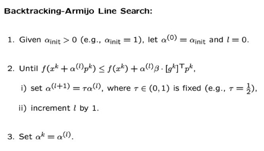

# Optimization-methods
Implementations of Optimization Algorithms like Simplex Algorithm, Steepest Gradient Descent, Newton's method.
REPORT.pdf contains plots and outputs for the below questions.
## 1.py: 
Consider minimization of the following function.

f (x1,x2) = ex1+3x2−0.1 + ex1−3x2−0.1 + e−x1−0.1

Implement steepest gradient descent to minimize the function. Use the stopping condition as ∥∇f (xk,xk)∥ ≤ ϵ with ϵ = 10−6. Use the following line search methods. 
1. Use exact line search method. 
2. Backtracking line search. For backtracking line search, see the Figure 1. 

Figure 1: Backtracking Line Search (to be used in Problem 1). pk is same as dk. τ = 0.7, β = 0.1.

For each case, report the following results.

1. Plot xk vs f (xk). In how many iterations, the algorithm converges.
1. Plot the contours of f . Plot the iterates xk generated by the gradient method (shown as small circles). After every update, using arrow show the movement between successive iterates in the contour plots.

## 2.py: 
Consider minimization of the following function.

f (x1,x2) = ex1+3x2−0.1 + ex1−3x2−0.1 + e−x1−0.1

Implement Newton method to minimize the function. Use the stopping condition as ∥∇f (xk1,xk2)∥ ≤ ϵ with ϵ = 10−6. Use backtracking line search. For backtracking line search, see the Figure 1. Use

τ = 0.7, β = 0.1.

Report the following results.

1. Plot xk vs f (xk). In how many iterations, the algorithm converges.
2. Plot the contours of f . Plot the iterates xk generated by the gradient method (shown as small circles). After every update, using arrow show the movement between successive iterates in

the contour plots. Also, in the same figure, plot {x|(x − xk)T∇2f (xk)(x − xk) ≤ 1}.

## 3.py: 
Consider steepest descent algorithm applied to the function f (x1,x2) = 5x21 +5x22 − x1x2 − 11x1 +11x2 +11. Find the eigen values of the Hessian matrix. Let λmax be the largest eigen value of the two.

1. Use fixed step size 0 < α < 2/λmax . Try five different starting points. For each starting point: λmax
- Show contour plot of the function. After every update, using arrow show the movement in the contour plots.
- How many iterations does it take to converge?

2. Use fixed step size α > 2/λmax

- Show contour plot of the function. After every update, using arrow show the movement in the contour plots.
- How many iterations does it take to converge?
 
 
4.py: Question in QUESTIONS.pdf

